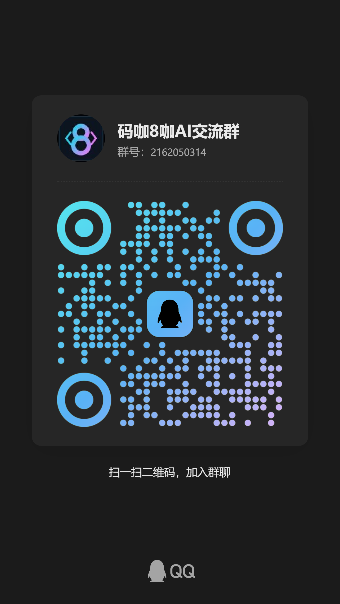

# Promo Relay Station

A small, compliance-first toolkit for preparing promotional posts across
multiple content platforms.

It helps you:

- keep campaign material in one workspace;
- describe each work item with JSON;
- generate platform-specific publishing drafts;
- generate reusable poster SVG assets from JSON configuration;
- keep manual publishing checkpoints clear for platforms that require login,
  CAPTCHA, QR scan, or final human confirmation.

This project does not bypass platform restrictions, login checks, CAPTCHA,
rate limits, or content review. It is designed for legitimate, user-owned
publishing workflows.

## Tutorial

Start here if you want a step-by-step Chinese guide with diagrams:

- [宣传中转站图文教程](docs/TUTORIAL.zh-CN.md)

## How To Use

This repository is a preparation workspace. It generates platform-ready drafts
and poster assets, then you publish them through the official creator pages.

1. Install the required tools.

   - Git: clone and push this repository.
   - Node.js: run poster generation scripts.
   - PowerShell: run draft generation scripts on Windows.

2. Create or edit a work item.

   Update a file under `works/`, for example
   `works/tokenaizf.work.json`. Keep the target URL, title, summary, tags,
   platform list, and asset paths accurate.

3. Generate platform drafts.

   ```powershell
   powershell -ExecutionPolicy Bypass -File .\scripts\generate-drafts.ps1
   ```

   Output path: `drafts/<work-id>/<platform>.md`

4. Generate poster SVG files.

   ```powershell
   node .\scripts\generate-tokenaizf-posters.js
   ```

   Output path: `assets/*.svg`

5. Review before publishing.

   Check the title length, body copy, tags, QR code, target URL, and platform
   declarations. Do not put account passwords, session cookies, or private
   tokens into Git.

6. Publish through official creator pages.

   Open the target platform page, upload the prepared media, paste the matching
   draft, preview the post, then confirm publish after the final review.

## Platform Page Flows

The detailed publishing guide is in [docs/PUBLISHING.md](docs/PUBLISHING.md).
Common entry points:

- 小红书: open `https://creator.xiaohongshu.com/publish/publish`, choose
  image/text or video note, upload media, paste the title/body from
  `drafts/<work-id>/xiaohongshu.md`, add tags, preview, then publish.
- 抖音: open `https://creator.douyin.com/creator-micro/content/upload`,
  upload video or image content, set cover, title, description, tags, visibility,
  and declarations, then publish.
- B站专栏: open
  `https://member.bilibili.com/platform/upload/text/new-edit`, paste the
  article draft from `drafts/<work-id>/bilibili.md`, set cover/category/tags,
  preview, then submit.
- B站视频: open `https://member.bilibili.com/platform/upload/video/frame`,
  upload video, fill title, partition, tags, description, cover, copyright
  declaration, then submit.
- 快手: open `https://cp.kuaishou.com/`, enter content publishing/upload,
  upload media, fill title/caption/tags, check visibility and declarations,
  then publish.
- 知乎: open `https://www.zhihu.com/`, enter the creator/write article flow,
  paste the long-form draft, add topic tags, preview, then publish.

## Project Layout

- `works/`: work item definitions.
- `configs/`: platform and poster configuration.
- `content/`: campaign copy packs and growth plans.
- `assets/`: generated or imported media assets. Ignored by default.
- `drafts/`: generated platform drafts. Ignored by default.
- `scripts/`: automation scripts.
- `docs/`: usage, publishing, and compliance notes.

## Work Item Format

Create a file in `works/` ending with `.work.json`:

```json
{
  "id": "example",
  "status": "draft",
  "title": "AI API gateway for developers",
  "hook": "Start by getting the API call path working.",
  "summary": "Describe who this is for, what problem it solves, and why people should try it.",
  "targetUrl": "https://example.com",
  "tags": ["AI", "API", "developer"],
  "assets": ["assets/example-cover.png"],
  "platforms": ["xiaohongshu", "douyin", "bilibili", "zhihu"],
  "notes": "Publish only after reviewing platform rules."
}
```

## Publishing Policy

Use official APIs where available. For browser-assisted publishing, keep a
human in the loop for login, CAPTCHA, payment, permissions, account selection,
and final publish confirmation.

See [docs/COMPLIANCE.md](docs/COMPLIANCE.md) and
[docs/PUBLISHING.md](docs/PUBLISHING.md).

## License

MIT. See [LICENSE](LICENSE).

## Community

Join the QQ group for AI workflow discussion, toolkit updates, and practical
automation notes:

- QQ group: `2162050314`
- Group name: `码咖8咖AI交流群`


