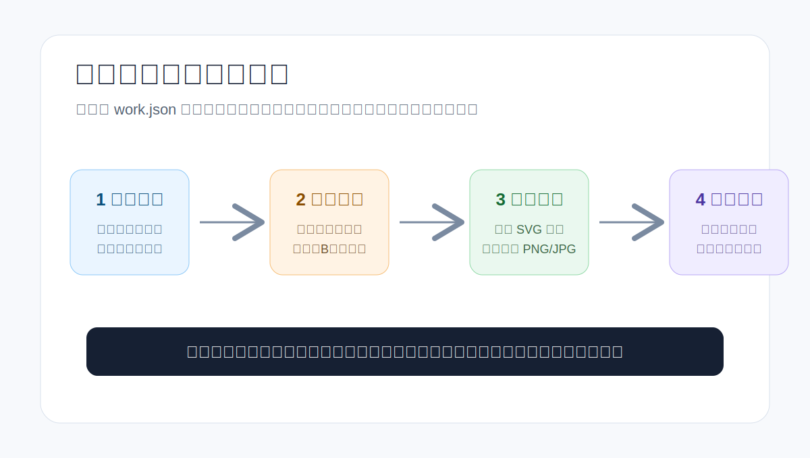
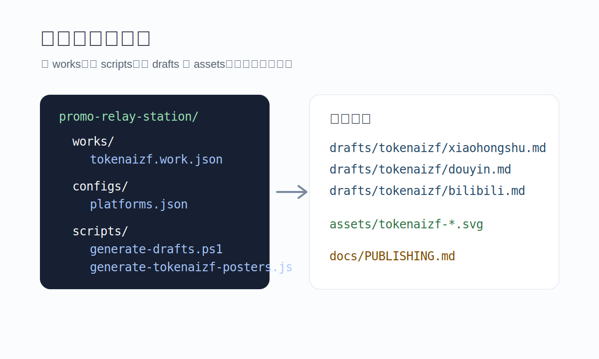
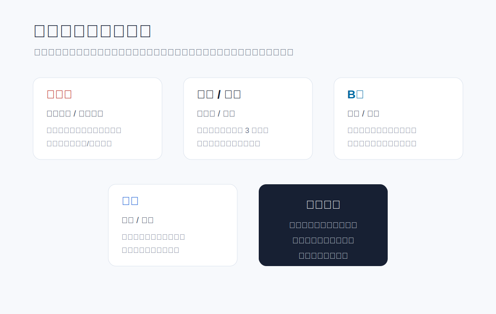

# 宣传中转站图文教程

这份教程适合第一次使用 `promo-relay-station` 的用户。你可以把它理解成一个“内容发布前的工作台”：先把项目资料写进配置文件，再一键生成各平台草稿和海报素材，最后到官方创作者后台完成发布。



## 1. 这个项目能解决什么

当你要把同一个项目发到小红书、抖音、B站、快手、知乎等平台时，最容易浪费时间的地方通常是：

- 每个平台标题长度不一样。
- 每个平台适合的正文节奏不一样。
- 海报、封面、标签、入口文案容易散落在不同文件里。
- 发布后不好复盘，下一次又要从头整理。

这个仓库的作用是把“准备内容”这件事标准化：

- 用 `works/*.work.json` 管理一个作品或项目。
- 用 `scripts/generate-drafts.ps1` 生成多平台发布草稿。
- 用 `scripts/generate-tokenaizf-posters.js` 生成海报 SVG。
- 用 `docs/PUBLISHING.md` 按平台检查发布流程。

工具只负责准备素材和草稿；账号登录、验证码、平台审核、最终发布确认，需要由账号本人完成。

## 2. 准备工具

建议准备这几个工具：

- Git：拉取仓库、提交更新、同步 GitHub。
- Node.js：运行海报生成脚本。
- PowerShell：运行草稿生成脚本，Windows 自带即可。
- 浏览器：打开小红书、抖音、B站、快手、知乎等创作者后台。

项目地址：

```text
https://github.com/Java-XuYingRui/promo-relay-station
```

本地推荐路径：

```text
D:\tools\promo-relay-station
```

## 3. 看懂目录结构



常用目录说明：

- `works/`：项目配置，一个 `.work.json` 代表一个要推广的项目。
- `configs/`：平台规则和海报配置，例如标题长度、默认 CTA。
- `content/`：完整文案包、增长计划、素材说明。
- `scripts/`：自动生成草稿和海报的脚本。
- `drafts/`：生成出来的平台草稿，默认不提交到 Git。
- `assets/`：生成出来的海报素材，默认不提交到 Git。
- `docs/`：教程、发布流程、合规说明。

## 4. 第一步：编辑项目配置

打开：

```text
works/tokenaizf.work.json
```

重点检查这些字段：

```json
{
  "id": "tokenaizf",
  "title": "TokenAI 中转站",
  "hook": "把 AI 接口调用、资料入口和工具导航整理到一个页面。",
  "summary": "适合需要统一管理 AI API、模型资料、工具入口和教程的人。",
  "targetUrl": "https://tokenaizf.cn/",
  "tags": ["AI工具", "AI接口", "效率工具"],
  "assets": ["assets/tokenaizf-cover.svg"],
  "platforms": ["xiaohongshu", "douyin", "bilibili", "zhihu"]
}
```

填写建议：

- `title`：项目名称或核心卖点。
- `hook`：第一句话，决定别人会不会继续看。
- `summary`：说明适合谁、解决什么问题、为什么值得点进去。
- `targetUrl`：你的中转站地址。
- `tags`：不要太多，优先选择和内容强相关的标签。
- `platforms`：需要生成哪些平台的草稿。

## 5. 第二步：生成多平台草稿

在项目根目录执行：

```powershell
powershell -ExecutionPolicy Bypass -File .\scripts\generate-drafts.ps1
```

生成后查看：

```text
drafts/tokenaizf/xiaohongshu.md
drafts/tokenaizf/douyin.md
drafts/tokenaizf/bilibili.md
drafts/tokenaizf/zhihu.md
```

使用方式很简单：打开对应平台的 `.md` 文件，把标题、正文、标签复制到发布页面里。

发布前一定要人工检查：

- 标题有没有超长。
- 第一段是否足够清楚。
- 标签有没有重复堆砌。
- 链接是否能打开。
- 是否包含账号密码、密钥、Cookie 等敏感信息。

## 6. 第三步：生成海报素材

在项目根目录执行：

```powershell
node .\scripts\generate-tokenaizf-posters.js
```

输出位置：

```text
assets/
```

默认输出是 SVG。如果平台要求 PNG 或 JPG，可以用浏览器、Figma、Canva、Photoshop、ImageMagick 等工具导出。

推荐尺寸：

- 小红书：3:4 或 4:5 竖图。
- 抖音/快手：9:16 竖版封面。
- B站视频：16:9 封面。
- B站专栏：横图或正文配图都可以。
- 知乎：配图不是必须，重点是正文可信度。

## 7. 第四步：按平台发布



### 小红书

入口：

```text
https://creator.xiaohongshu.com/publish/publish
```

操作流程：

1. 登录并确认账号正确。
2. 选择图文笔记或视频笔记。
3. 上传海报、截图或视频。
4. 打开 `drafts/tokenaizf/xiaohongshu.md`。
5. 复制标题到标题栏。
6. 复制正文到内容区域。
7. 添加标签和话题。
8. 检查可见范围、声明、合集等设置。
9. 预览没问题后发布。

建议：

- 标题短一点，尽量一眼看懂。
- 首句直接说结果或痛点。
- 引流口径用“主页入口”“置顶入口”这类更自然的表达。

### 抖音

入口：

```text
https://creator.douyin.com/creator-micro/content/upload
```

操作流程：

1. 登录抖音创作者中心。
2. 上传视频或图文素材。
3. 设置封面。
4. 打开 `drafts/tokenaizf/douyin.md`。
5. 复制标题、描述和标签。
6. 检查可见范围、原创、商业、AI 生成内容等声明。
7. 预览后发布。

建议：

- 封面文字要大，手机上也能看清。
- 视频前三秒先讲结果，不要铺垫太久。
- 外链不一定能直接放，优先用主页承接。

### B站专栏

入口：

```text
https://member.bilibili.com/platform/upload/text/new-edit
```

操作流程：

1. 登录 B站创作中心。
2. 打开专栏投稿页面。
3. 打开 `drafts/tokenaizf/bilibili.md`。
4. 复制标题和正文。
5. 插入封面、截图或二维码。
6. 设置分区、标签、文集。
7. 检查原创、版权、商业声明。
8. 预览后提交。

建议：

- B站适合写教程、更新日志、资源整理。
- 标题不要太长，避免提交时报错。
- 正文分段清楚，方便读者收藏。

### B站视频

入口：

```text
https://member.bilibili.com/platform/upload/video/frame
```

操作流程：

1. 上传视频文件。
2. 设置标题、分区、标签、封面。
3. 用 `drafts/tokenaizf/bilibili.md` 改成视频简介。
4. 填写版权、来源、商业声明。
5. 上传完成后预览。
6. 检查无误后提交。

建议：

- 封面用 16:9。
- 标题前半句写核心价值。
- 简介里可以放项目地址，但要遵守平台当前规则。

### 快手

入口：

```text
https://cp.kuaishou.com/
```

操作流程：

1. 登录快手创作者服务平台。
2. 进入内容发布或上传入口。
3. 上传视频或图文素材。
4. 打开 `drafts/tokenaizf/kuaishou.md`。
5. 复制标题、正文、标签。
6. 设置封面、可见范围和声明。
7. 预览后发布。

建议：

- 开头表达要更直接。
- 封面文字尽量少，但要醒目。
- 不要把同一套标签机械复制到每条内容。

### 知乎

入口：

```text
https://www.zhihu.com/
```

操作流程：

1. 登录知乎。
2. 进入写文章或回答问题。
3. 打开 `drafts/tokenaizf/zhihu.md`。
4. 复制标题和正文。
5. 增加实际场景、操作细节和截图。
6. 添加话题。
7. 检查链接和声明。
8. 预览后发布。

建议：

- 知乎更适合“为什么这样做”和“具体怎么做”。
- 少用口号，多写真实问题和解决过程。
- 标题可以偏搜索型，例如“如何搭建一个 AI 工具中转站”。

## 8. 发布前总检查

每个平台发布前都检查一次：

- 账号是不是正确。
- 内容是不是自己有权发布。
- 标题有没有超长。
- 链接是否可访问。
- 图片是否清晰。
- 标签是否准确。
- 是否有平台要求的声明。
- 是否误放账号密码、Token、Cookie、隐私截图。

## 9. 发布后复盘

建议记录一个简单表格：

| 平台 | 发布时间 | 标题 | 链接 | 浏览 | 点赞 | 收藏 | 评论 | 下一步 |
| --- | --- | --- | --- | --- | --- | --- | --- | --- |
| 小红书 | 2026-07-07 | 示例标题 | 待填 | 待填 | 待填 | 待填 | 待填 | 优化封面 |
| B站 | 2026-07-07 | 示例标题 | 待填 | 待填 | 待填 | 待填 | 待填 | 补充教程 |

复盘重点：

- 哪个平台点击最高。
- 哪种标题更容易被点开。
- 哪张封面更容易被收藏。
- 评论区里大家最关心什么问题。
- 下一条内容应该补充什么。

## 10. 常见问题

### 草稿没有生成怎么办

检查：

- 是否在项目根目录执行命令。
- `works/*.work.json` 是否是合法 JSON。
- `platforms` 里的平台 id 是否存在于 `configs/platforms.json`。

### 平台提示标题太长怎么办

直接缩短标题，把细节放到正文第一段。比如：

```text
原标题：我整理了一个适合 AI 工具和接口管理的中转站
短标题：AI 工具中转站
```

### 可以全自动发布吗

不建议。发布平台经常需要登录、验证码、二维码确认、声明勾选、账号选择和最终确认。这个项目的定位是“自动准备内容”，不是绕过平台规则。

### 二维码或社群入口放哪里合适

README 里建议放底部，不要占用项目说明首屏。平台内容里建议根据规则使用“主页入口”“置顶入口”“评论区说明”等自然表达。

## 11. 社群

QQ 群：`2162050314`

群名：`码咖8咖AI交流群`


